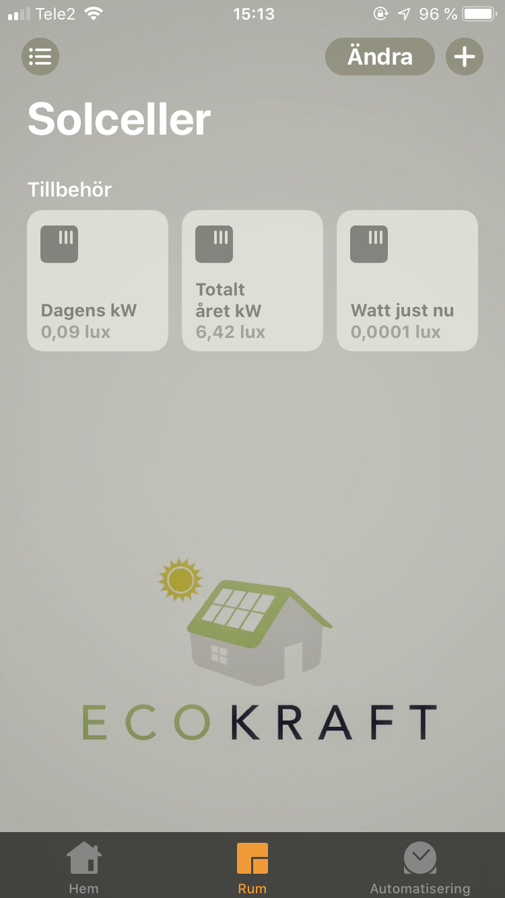

# homebridge-symo-cmd
homebridge-plugin for a quick and easy way to get readings from a Fronius Symo

Inspired by homebridge-temperature-cmd

# Installation

1. Install homebridge using: sudo npm install -g homebridge
2. Install this plugin using: sudo npm install -g homebridge-symo-cmd
3. Make sure that curl and jq are istalled.
4. Update your configuration file. See sample-config.json in this repository for a sample.

# Configuration

You can add more accessories of SymoCMD in the config.json for homebridge 
just copy the first accesory and rename it eg. if you want Year Total (E_Year), Day Total (E_Day) and Current Watts (E_PV)

```
"accessories": [
    {
        "accessory": "SymoCMD",
        "name": "Current kWh",
        "command": "curl -s http://192.168.x.x/solar_api/v1/GetPowerFlowRealtimeData.fcgi | jq '.Body.Data.Site.E_PV'"
    },
    {
        "accessory": "SymoCMD",
        "name": "Year total",
        "command": "curl -s http://192.168.x.x/solar_api/v1/GetPowerFlowRealtimeData.fcgi | jq '.Body.Data.Site.E_Year'"
    }
]
```

# Example

Mine looks like this;

